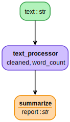
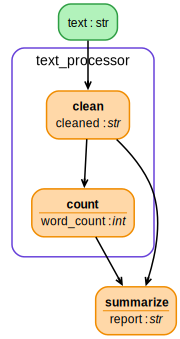
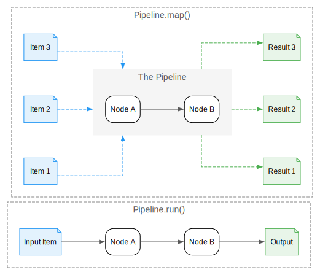
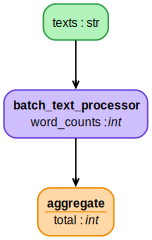

<div align="center"><picture>
  <source media="(prefers-color-scheme: dark)" srcset="assets/dark_background_logo.png">
  
</picture></div>

<p align="center">
  <b>Hierarchical, Modular Data Pipelines for AI/ML</b>
</p>

<p align="center">
  <a href="#-the-three-step-pattern">Core Pattern</a> •
  <a href="#-smart-caching">Caching</a> •
  <a href="#-scale-with-daft">Daft</a> •
  <a href="#-documentation">Docs</a> •
  <a href="#-installation">Install</a>
</p>

---

## Why HyperNodes?

Data pipelines are **run more than written** — you execute the same code on the same data *hundreds of times* during development. Every run costs time and money.

HyperNodes solves this with two core ideas:

| | |
|---|---|
| **🎯 Think Singular** | Write logic for *one item*. No batch loops. Clean, testable code. |
| **📦 Smart Caching** | Only compute what changed. Resume from where you left off. |

---

## ✨ The Three-Step Pattern

### 1️⃣ Think Singular

Write functions that process **one item**. No batch loops, no complexity — just clean, testable code.

```python
from hypernodes import Pipeline, node

@node(output_name="cleaned")
def clean(text: str) -> str:
    return text.strip().lower()

@node(output_name="word_count")
def count(cleaned: str) -> int:
    return len(cleaned.split())

# Create a named pipeline
text_processor = Pipeline(nodes=[clean, count], name="text_processor")

result = text_processor.run(inputs={"text": "  Hello World  "})
# {'cleaned': 'hello world', 'word_count': 2}
```

<p align="center">

<br/><em>The <code>text_processor</code> pipeline</em>
</p>

---

### 2️⃣ Compose

Pipelines are nodes. Use `text_processor` inside a larger workflow — it appears as a single unit.

```python
@node(output_name="report")
def summarize(word_count: int, cleaned: str) -> str:
    return f"Processed: {word_count} words"

# text_processor becomes a node in the analysis pipeline
analysis = Pipeline(nodes=[text_processor.as_node(), summarize], name="analysis")
```

<p align="center">

<br/><em>Collapsed view — <code>text_processor</code> as a single node</em>
</p>

Expand to see the internals:

<p align="center">

<br/><em>Expanded view — see inside <code>text_processor</code></em>
</p>

---

### 3️⃣ Scale

Process many items with `.map()`. The same single-item logic runs over a collection.

#### `run()` vs `map()` at a glance

<p align="center">

<br/><em>Single-item execution versus per-item fan-out.</em>
</p>

| `Pipeline.run()` | `Pipeline.map()` |
| --- | --- |
| Accepts a **single input item** and executes the DAG once. | Accepts **lists or iterables** for the keys listed in `map_over`. |
| Returns a single dict of outputs. | Returns a list of dicts (one per item). |
| Cache signatures cover the full set of inputs for that run. | Cache signatures are computed **per item**, enabling incremental recompute. |

```python
# Process multiple texts
results = text_processor.map(
    inputs={"text": ["Hello", "World", "Foo Bar"]},
    map_over="text"
)
# [{'cleaned': 'hello', 'word_count': 1}, 
#  {'cleaned': 'world', 'word_count': 1},
#  {'cleaned': 'foo bar', 'word_count': 2}]
```

Or wrap it as a batch processor in a larger pipeline:

```python
batch_processor = text_processor.as_node(
    name="batch_text_processor",
    map_over="texts",
    input_mapping={"texts": "text"},
    output_mapping={"word_count": "word_counts"}
)
```

<p align="center">

<br/><em>Batch processing with <code>map_over</code></em>
</p>

## 📦 Smart Caching

HyperNodes implements a content-addressable cache that keeps runs fast **and** correct.

| Scenario | Without Cache | Naive Cache | HyperNodes Cache |
| :--- | :--- | :--- | :--- |
| **Process 10 items (first time)** | 10s | 10s | 10s |
| **Process 10 items (again)** | 10s | **Instant** | **Instant** |
| **Process 15 items**<br>*(10 old + 5 new)* | 15s | 15s (Full re-run) | **5s** (Only new items) |
| **Drop or edit 1 item** | 14s | 14s (Full re-run) | **1s** (Only changed item) |

### How it works

It hashes:
- **Function signature** (source code, closures, defaults)
- **Input values** (per item in `.map()`)
- **Dependencies** (upstream node signatures)

Only nodes whose hashes changed will execute.

### Enable caching in 3 steps

1. **Pick a backend** – `DiskCache` ships by default; swap in Redis/S3 later.
2. **Attach it to an engine** – `SeqEngine(cache=DiskCache(path=".cache"))`.
3. **Run pipelines as usual** – `pipeline.run(...)` or `pipeline.map(...)` automatically uses the cache.

```python
from hypernodes import Pipeline, DiskCache, SeqEngine

engine = SeqEngine(cache=DiskCache(path=".cache"))
pipeline = Pipeline(nodes=[clean, count], engine=engine)
pipeline.run(inputs={"text": "hello"})  # warm cache
```

### Incremental map runs (per-item signatures)

Caching shines when datasets change gradually. Each item inside `.map()` gets its own signature, so adding a single record does **not** blow away the cache for the entire batch.

```python
from hypernodes import Pipeline, SeqEngine, DiskCache, node

@node(output_name="features")
def featurize(text: str) -> dict[str, int]:
    print(f"computing -> {text}")
    return {"len": len(text)}

engine = SeqEngine(cache=DiskCache(path=".cache"))
featurizer = Pipeline(nodes=[featurize], engine=engine)

# 1) Initial batch – every item is a miss
featurizer.map(inputs={"text": ["alpha", "beta"]}, map_over="text")

# 2) Append one more record – only "delta" recomputes
featurizer.map(inputs={"text": ["alpha", "beta", "delta"]}, map_over="text")
```

**Tip:** Visualize before long runs. Cached (grey) vs running (colored) nodes stand out in the HTML/SVG artifact.

```python
featurizer.visualize(
    filename="outputs/cache_walkthrough.svg",
    engine="graphviz",
    separate_outputs=True,
    depth=None,
)
```

### Node-level reuse across complex DAGs

Because caching happens per node, you can pause/resume multi-stage DAGs without re-running upstream work. Here’s a more realistic extraction → embedding pipeline:

```python
@node(output_name="cleaned")
def clean(text: str) -> str:
    return text.strip().lower()

@node(output_name="embedding")
def embed(cleaned: str, model: str) -> list[float]:
    return encoder[model](cleaned)  # Expensive!

@node(output_name="doc")
def package(cleaned: str, embedding: list[float]) -> dict:
    return {"text": cleaned, "vector": embedding}

pipe = Pipeline(nodes=[clean, embed, package], engine=SeqEngine(cache=DiskCache(".cache")))
pipe.run(inputs={"text": "Hello", "model": "v1"})

# Change only the final step; upstream nodes stay cached
@node(output_name="doc")
def package(cleaned: str, embedding: list[float]) -> dict:
    return {"text": cleaned, "vector": embedding, "v": 2}

pipe.run(inputs={"text": "Hello", "model": "v1"})
# clean() and embed() hit cache, only package() reruns
```

| Change | Re-run cost without cache | With HyperNodes |
| :--- | :--- | :--- |
| Update final formatting node | All nodes re-execute | Only the last node runs |
| Swap to `model_name="large"` | All nodes | Only `embed` + dependents |
| Reuse `clean` output in another pipeline | Duplicate compute | Cache hit across pipelines (same node signature) |

Use `pipeline.engine.cache.inspect(signature)` (or custom cache utilities) if you ever want to programmatically verify whether a node is cached before triggering a heavy run.

### Code-aware invalidations (no stale runs)

The cache is just as smart about **code changes**. HyperNodes hashes the function body *and* anything it touches (imports, closures, default arguments). If a helper changes, the dependent node automatically invalidates.

```python
# helpers.py
def normalize(text):
    return text.lower()

@node(output_name="clean")
def clean(text: str) -> str:
    return normalize(text)

pipe = Pipeline(nodes=[clean], engine=SeqEngine(cache=DiskCache(".cache")))
pipe.run(inputs={"text": "Hello"})

# Change helpers.py -> normalize()
def normalize(text):
    return text.lower().strip()

pipe.run(inputs={"text": "Hello"})  # cache miss – dependency changed!
```

Default arguments, environment variables, and closure state are also part of the hash.

| Scenario | Traditional Cache | HyperNodes |
| :--- | :--- | :--- |
| Function body edited | Might stay cached → stale | Auto-invalidated |
| Helper/import updated | Usually ignored | Auto-invalidated |
| Default arg / env var changed | Often missed | Captured in signature |
| Closure state mutated | Rarely detected | Captured in signature |

Need to know **why** a node reran? Enable `LOG_HYPERNODES_CACHE=1` (env var) to log cache hits/misses, or plug in a callback that records `on_node_cached` events for your observability system.

---

## 🚀 Scale with Daft

When you're ready for distributed execution, plug in **[Daft](https://www.getdaft.io/)** — same pipeline code, now runs on a cluster.

```python
from hypernodes.engines import DaftEngine

engine = DaftEngine(use_batch_udf=True)
pipeline = Pipeline(nodes=[clean, count], engine=engine)

# Auto-batched, distributed, with per-item caching
results = pipeline.map(inputs={"text": texts * 10000}, map_over="text")
```

Daft provides:
- **Distributed execution** — laptop to cluster, no code changes
- **Auto-batching** — optimal batch sizes computed automatically
- **Per-item caching** — even in distributed mode, each item is cached independently

---

## 💡 Inspiration

HyperNodes stands on the shoulders of giants. It was inspired by and grew from working with:
- **[Pipefunc](https://github.com/pipefunc/pipefunc)**: For its elegant approach to function composition.
- **[Apache Hamilton](https://github.com/dagworks-inc/hamilton)**: For its paradigm of defining dataflows using standard Python functions.

HyperNodes aims to bring native support for hierarchical pipelines and advanced caching to this ecosystem.

---

## 📚 Documentation

The full documentation is available in the `docs/` directory:

- **[Introduction & Quick Start](docs/introduction.mdx)**
- **Core Concepts**
    - [Nodes](docs/01-core-concepts/01-nodes.md)
    - [Pipelines](docs/01-core-concepts/02-pipelines.md)
    - [Execution](docs/01-core-concepts/03-execution.md)
- **Data Processing**
    - [Mapping (Parallel Processing)](docs/02-data-processing/01-mapping.md)
    - [Nesting Pipelines](docs/02-data-processing/02-nesting.md)
    - [Caching](docs/02-data-processing/03-caching.md)
- **Scaling & Optimization**
    - [Engines Overview](docs/03-scaling/01-engines.md)
    - [Distributed Daft Engine](docs/03-scaling/02-daft-engine.md)
    - [Stateful Parameters](docs/03-scaling/03-stateful.md)
- **Observability**
    - [Visualization](docs/04-observability/01-visualization.md)
    - [Telemetry & Progress](docs/04-observability/02-telemetry.md)

---

## 🚀 Installation

```bash
pip install hypernodes
# or with uv
uv add hypernodes
```

---

## 📄 License

MIT License - see LICENSE file for details.
