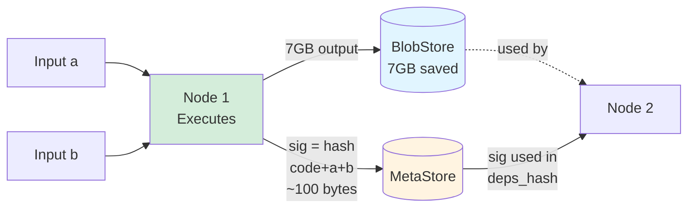
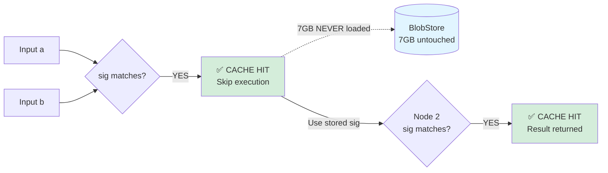
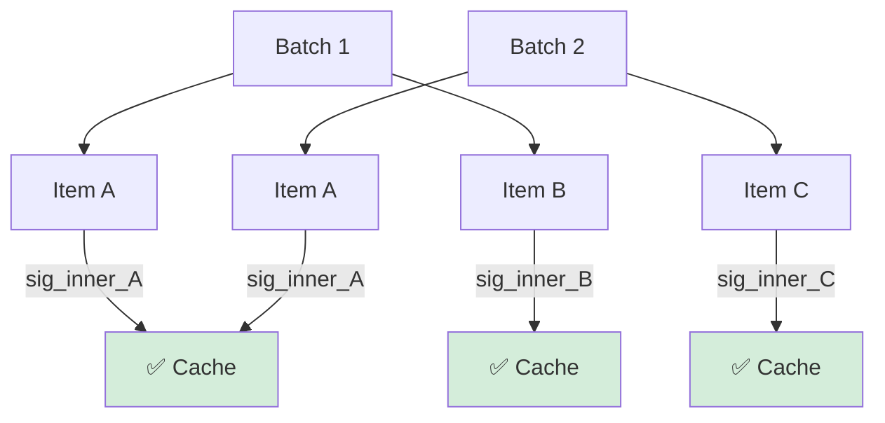
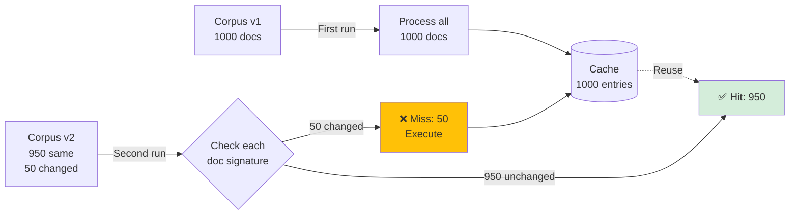

# Caching

# Overview

This system implements **incremental computation** through **content-addressed, dependency-aware memoization**. Instead of re-running expensive computations when inputs change, the system automatically determines which nodes need re-execution and reuses cached results for everything else.

**Core guarantee**: If a node's code, direct inputs, and upstream dependencies haven't changed, its output is guaranteed to be identical—so we skip execution and reuse the cached result.

### Demand-Driven Efficiency

The system uses **demand-driven** (pull-based) incremental computation:[[1]](https://www.cs.umd.edu/~hammer/adapton/)[[2]](https://xi-editor.io/docs/rope_science_12.html)

**Example**: You have a 100-node pipeline and change code in one leaf node:

1. The system checks signatures in **topological order** (milliseconds per node)
2. First 98 nodes: **CACHE HIT** → skip immediately, outputs stay in cache (not loaded)
3. Node 99: **CACHE MISS** → load only its direct inputs from cache, execute
4. Node 100: **CACHE MISS** → load Node 99's new output, execute

**What doesn't happen:**

- ❌ Loading outputs from the first 98 nodes
- ❌ Verifying or deserializing upstream data
- ❌ Recomputing or re-validating unchanged nodes

This **minimal invalidation** means changes to leaf nodes are nearly instant, regardless of pipeline size. The system only touches what changed and its direct dependents.

### Visual Example: No Output Hashing



**Second run (a, b unchanged):**



**Key insight**: The 7GB output is represented by its parent's signature. We never hash or load it to verify the cache.

---

# The Solution: Computation Signatures

**Core Insight**: *"Same code + same inputs + same upstream dependencies = same output"*

Instead of hashing outputs, we compute a lightweight **computation signature** (cache key) for each node based on its inputs and dependencies:

```
sig(node) = hash(
    code_hash      # Function source code
    + env_hash     # Environment (library versions, model version, config salt)
    + inputs_hash  # Direct input values  
    + deps_hash    # Signatures of upstream nodes (recursive)
)
```

This is a form of **content-addressed caching**: the signature uniquely identifies the computation, and identical signatures guarantee identical outputs.

### Key Properties

**Lightweight**: Signatures are ~100 bytes, computed in milliseconds

**Recursive**: Each node's signature includes its parents' signatures, creating a dependency chain

**Deterministic**: Same inputs always produce the same signature

**Lazy loading**: Cached outputs are only loaded when actually needed by downstream nodes

---

# How It Works

## Storage Architecture

**MetaStore** (lightweight, fast)

- Stores computation signatures (~100 bytes per node)
- Fast lookup and comparison (SQLite, Redis, JSON file)
- Checked on every node before execution

**BlobStore** (large, lazy)

- Stores actual outputs (can be GBs)
- Only loaded when needed by downstream nodes
- Can use local disk, S3, GCS, etc.

## Execution Flow

For each node in topological order:

1. **Compute signature** from code, inputs, and parent signatures
2. **Check MetaStore**: Does this signature exist?
3. **Cache hit**:
    - Skip execution
    - Mark output as available from cache
    - Lazily load from BlobStore only if downstream node needs it
4. **Cache miss**:
    - Execute the node
    - Save output to BlobStore
    - Store signature in MetaStore

---

# Detailed Scenarios

These scenarios demonstrate the **fine-grained invalidation** that makes incremental computation powerful.

## Scenario 1: Downstream Parameter Change

**Setup:**

```python
@node(output_name="foo_out")
def foo(a: Data, b: Config) -> Result:
    return expensive_transform(a, b)

@node(output_name="final")  
def bar(foo_out: Result, c: Param) -> Final:
    return finalize(foo_out, c)

# DAG: (a, b) -> foo -> bar(foo_out, c)
```

```python
@node(output_name="foo_out")
def foo(a: Data, b: Config) -> Result:
    return expensive_transform(a, b)

@node(output_name="final")  
def bar(foo_out: Result, c: Param) -> Final:
    return finalize(foo_out, c)

# DAG: (a, b) -> foo -> bar(foo_out, c)
```

**Change**: Only parameter `c` is modified

**What happens:**

| Node | Signature Check | Action | Reason |
| --- | --- | --- | --- |
| `foo` | ✅ **HIT** | Skip execution | Inputs `a` and `b` unchanged |
| `bar` | ❌ **MISS** | Execute | Input `c` changed |

**Result**:

- `foo` is **not** re-run (saves computation)
- `foo_out` is loaded from BlobStore (lazy)
- Only `bar` executes with the cached `foo_out` and new `c`

**Why this matters**: Changing downstream parameters (like model hyperparameters) doesn't invalidate upstream data processing.

---

## Scenario 2: Full Cache Hit (Nothing Changed)

**Setup**: Same pipeline as Scenario 1

**Change**: Nothing—identical inputs to a previous run

**What happens:**

| Node | Signature Check | Action | Reason |
| --- | --- | --- | --- |
| `foo` | ✅ **HIT** | Skip execution | All inputs unchanged |
| `bar` | ✅ **HIT** | Skip execution | `foo_out` signature + `c` unchanged |

**Result**:

- Both nodes skip execution
- `foo_out` is **not even loaded** from BlobStore
- Final result is instantly returned from `bar`'s cache
- Total execution time: ~milliseconds (just signature checks)

**Why this matters**: Re-running the exact same pipeline (e.g., debugging, testing) is instant.

---

## Scenario 3: Upstream Input Change

**Setup**: Same pipeline as Scenario 1

**Change**: Input `a` is modified

**What happens:**

| Node | Signature Check | Action | Reason |
| --- | --- | --- | --- |
| `foo` | ❌ **MISS** | Execute | Input `a` changed |
| `bar` | ❌ **MISS** | Execute | Dependency `sig(foo)` changed |

**Result**:

- `foo` re-runs with new input `a`, producing new output and `new_sig(foo)`
- `bar`'s signature check includes `sig(foo)` in its `deps_hash`
- Even though `c` didn't change, `bar` sees different `deps_hash` → cache miss
- Both nodes execute

**Why this matters**: Upstream changes correctly invalidate downstream nodes through recursive signature propagation.

---

## Scenario 4: Code Change

**Setup**: Same pipeline as Scenario 1

**Change**: Modify the implementation of `foo()` (e.g., fix a bug, change algorithm)

**What happens:**

| Node | Signature Check | Action | Reason |
| --- | --- | --- | --- |
| `foo` | ❌ **MISS** | Execute | `code_hash` changed |
| `bar` | ❌ **MISS** | Execute | Dependency `sig(foo)` changed |

**Result**: Similar to Scenario 3—code changes propagate through the dependency chain

**Why this matters**: You don't need to manually invalidate caches when changing code. The system detects it automatically.

---

## Scenario 5: Map Operation with Partial Cache Hits

**Setup:**

```python
pipeline = Pipeline(nodes=[clean_text, encode_text])

# First run with 3 items
results = [pipeline.map](http://pipeline.map)(inputs={"text": ["Hello", "World", "Foo"]}, map_over="text")

# Second run with 5 items (2 new, 3 repeated)
results = [pipeline.map](http://pipeline.map)(inputs={"text": ["Hello", "World", "Foo", "Bar", "Baz"]}, map_over="text")
```

**What happens on second run:**

| Item | Signature Check | Action | Reason |
| --- | --- | --- | --- |
| "Hello" | ✅ **HIT** | Skip | Already computed in first run |
| "World" | ✅ **HIT** | Skip | Already computed in first run |
| "Foo" | ✅ **HIT** | Skip | Already computed in first run |
| "Bar" | ❌ **MISS** | Execute | New item |
| "Baz" | ❌ **MISS** | Execute | New item |

**Result**: Only 2 new items are processed; 3 previous items retrieved from cache

**Why this matters**:

- Iteratively growing datasets doesn't re-process existing items
- Failed batch jobs can be restarted without re-processing successful items
- Each item is independently cached—fine-grained incremental computation

---

# Per-Node Cache Control

By default, **all nodes are cached** when a cache backend is configured on the pipeline. You can opt out at the function level for nodes that should never be cached.

## Disabling Cache for Specific Nodes

Use `cache=False` in the `@node` decorator:

```python
# Normal cached node
@node(output_name="processed_data")
def process_data(raw_data: Data) -> Processed:
    return expensive_processing(raw_data)

# Never cache this node
@node(output_name="live_data", cache=False)
def fetch_live_data(api_key: str) -> Data:
    """Fetch real-time data that should never be cached"""
    return requests.get(f"
```

```python
# Normal cached node
@node(output_name="processed_data")
def process_data(raw_data: Data) -> Processed:
    return expensive_processing(raw_data)

# Never cache this node
@node(output_name="live_data", cache=False)
def fetch_live_data(api_key: str) -> Data:
    """Fetch real-time data that should never be cached"""
    return requests.get(f"
```

**When to use `cache=False`:**

- **Real-time data sources**: APIs, live databases, current timestamps
- **Non-deterministic operations**: Random sampling, UUIDs, timestamps
- **Side effects**: Logging, metrics, notifications
- **Debugging**: Temporarily disable caching to force re-execution

**How it works:**

- Node is always executed, even if signature matches
- Output is **not** saved to BlobStore
- Downstream nodes **can still be cached** based on the uncached node's output
- Useful for splitting "data fetching" (uncached) from "data processing" (cached)

## Enabling Cache

Caching is **opt-in at the pipeline level**. Nodes are only cached if a cache backend is configured:

```python
from pipeline_system import Pipeline, DiskCache

# Without cache: nodes always execute
pipeline = Pipeline(nodes=[foo, bar])

# With cache: nodes use caching (unless cache=False)
pipeline = Pipeline(
    nodes=[foo, bar],
    cache=DiskCache(path=".cache")
)
```

This design ensures:

- **Explicit cache configuration**: No hidden caching behavior
- **Easy testing**: Run without cache during development
- **Flexible deployment**: Different cache backends for dev vs. production

---

# Object Serialization for Cache Keys

## Problem

Custom objects (models, configs, retrievers) need deterministic cache keys. Two instances with the same configuration should produce the same signature.

## Solution: Two Strategies

### Strategy 1: Custom Cache Keys (Recommended)

Classes define their own cache key via `__cache_key__()`:

```python
class ModelConfig:
    def __init__(self, model_name: str, temperature: float):
        self.model_name = model_name
        self.temperature = temperature
        self._internal_counter = 0  # Private state
        
    def __cache_key__(self) -> str:
        import json
        return f"{self.__class__.__name__}::{json.dumps({
            'model': self.model_name,
            'temp': self.temperature
        }, sort_keys=True)}"

# These produce the same cache key
config1 = ModelConfig("gpt-4", 0.7)
config2 = ModelConfig("gpt-4", 0.7)
assert config1.__cache_key__() == config2.__cache_key__()
```

**Best for**: Complex objects where you want explicit control over what affects caching

### Strategy 2: Automatic Serialization

If `__cache_key__()` is not defined, automatically serialize public attributes (excluding private ones starting with `_`):

```python
class SimpleConfig:
    def __init__(self, batch_size: int, learning_rate: float):
        self.batch_size = batch_size
        self.learning_rate = learning_rate
        self._internal_state = {}  # Excluded from hash (private)

# Two instances with same config share cache automatically
config1 = SimpleConfig(32, 0.001)
config2 = SimpleConfig(32, 0.001)
# These produce the same cache key!
```

**Best for**: Simple data classes with straightforward serialization

### Serialization Depth

Control how deep to serialize nested objects:

```python
from pipeline_system import CacheConfig, DiskCache

cache = DiskCache(
    cache_dir=".cache",
    serialization_depth=2  # Default: recurse 2 levels into nested objects
)

pipeline = Pipeline(nodes=[...], cache=cache)
```

---

# Cache Configuration & Inheritance

Cache configuration follows the hierarchical inheritance system (see [Core Concepts](Core%20Concepts%204a4dd7402980462eb83fc2b3d5059ccc.md) for details).

## Basic Configuration

```python
# Parent defines cache
parent = Pipeline(
    nodes=[...],
    cache=RedisCache(host="[localhost](http://localhost)", port=6379)
)

# Child inherits RedisCache
child = Pipeline(
    nodes=[...]
    # No cache specified → inherits RedisCache from parent
)

# Grandchild overrides to disable caching
grandchild = Pipeline(
    nodes=[...],
    cache=None  # Override: disable caching for this sub-pipeline
)
```

## Practical Use Cases

**Development vs. Production:**

```python
# Development: local disk cache
dev_pipeline = Pipeline(
    nodes=[...],
    cache=DiskCache(path=".cache")
)

# Production: shared Redis cache with same nested pipelines
prod_pipeline = Pipeline(
    nodes=[...],
    cache=RedisCache(host="[prod-redis.example.com](http://prod-redis.example.com)")  # Override at top level
)
```

**Selective cache disabling:**

```python
# Most of pipeline uses cache
outer = Pipeline(
    nodes=[load_data, preprocess, expensive_pipeline, postprocess],
    cache=RedisCache()
)

# But one sub-pipeline should never cache (e.g., real-time data)
expensive_pipeline = Pipeline(
    nodes=[fetch_live_data, process],
    cache=None  # Override: always fetch fresh data
)
```

**Mixed cache backends:**

```python
# Local cache at top level
level_1 = Pipeline(
    nodes=[...],
    cache=DiskCache(path="/tmp/cache")
)

# Remote sub-pipeline with remote cache
level_2 = Pipeline(
    nodes=[...],
    backend=ModalBackend(gpu="A100"),
    cache=S3Cache(bucket="my-cache-bucket")  # Override: use S3 for remote execution
)
```

## Inheritance Rules

1. **Explicit cache configuration always overrides** parent cache
2. **`cache=None` explicitly disables caching**, even if parent has cache enabled
3. **No cache parameter means inherit** from parent
4. **Inheritance is recursive** through multiple nesting levels

This allows you to define a default caching strategy at the top level while selectively optimizing or disabling caching for specific sub-pipelines.

---

# Cache Backends

The system supports multiple cache storage backends:

**DiskCache**: Local filesystem storage

- Fast for single-machine workflows
- Simple setup, no infrastructure needed
- Example: `.cache/` directory

**RedisCache**: Shared in-memory cache

- Fast remote access
- Shared across multiple machines/users
- Requires Redis server

**S3Cache / GCSCache**: Cloud object storage

- Unlimited capacity
- Shared across distributed teams
- Higher latency but good for large artifacts

**Custom**: Implement your own backend

- Implement `MetaStore` and `BlobStore` interfaces
- Use specialized storage (databases, NFS, etc.)

---

# Related Concepts

This caching approach is inspired by and shares concepts with:

- **Build systems** (Bazel, Buck2, Nix): Content-addressed caching with dependency tracking[[1]](https://jade.fyi/blog/build-systems-ca-tracing/)[[2]](https://docs.buildstream.build/master/arch_cachekeys.html)
- **Incremental computation**: Academic work on self-adjusting computation[[3]](https://dl.acm.org/doi/10.1145/640128.604133)[[4]](https://par.nsf.gov/servlets/purl/10511075)
- **Compositional memoization**: Libraries like Mandala for scientific computing[[5]](https://proceedings.scipy.org/articles/JHPV7385)
- **Dataflow systems**: Computation graphs with automatic recomputation (Dask, Spark)

The key innovation is applying these patterns specifically to ML/AI workflows with large intermediate artifacts.

- **Dataflow systems**: Computation graphs with automatic recomputation (Dask, Spark)

The key innovation is applying these patterns specifically to ML/AI workflows with large intermediate artifacts.

---

# Edge Cases: Nested Pipelines with Mapping

Nested pipelines with map operations introduce complex caching scenarios. Here are critical edge cases to handle:

## 1. Double Mapping: Outer Maps Over Inner Mapped Pipeline

**Scenario:**

```python
# Inner pipeline processes ONE item
inner = Pipeline(nodes=[clean, encode])

# Inner is used with map_over in .as_node()
encode_corpus = [inner.as](http://inner.as)_node(
    input_mapping={"corpus": "item"},
    output_mapping={"result": "encoded_item"},
    map_over="corpus"  # Inner maps over corpus items
)

# Outer pipeline ALSO maps
outer = Pipeline(nodes=[load_batch, encode_corpus, aggregate])

# Double map: outer maps over batches, inner maps over items in each batch
results = [outer.map](http://outer.map)(
    inputs={"batch_id": [1, 2, 3]},
    map_over="batch_id"
)
```

**Caching challenge:**

- Outer pipeline signature: `sig(outer, batch_id=1)`, `sig(outer, batch_id=2)`, etc.
- Inner pipeline signature: `sig(inner, item=X)` for each item in each batch
- Cache keys must capture BOTH levels: `(outer_execution_id, batch_id, item_id)`

**Solution:**

- Each map item gets a unique execution context
- Inner pipeline signatures include the outer execution context in their namespace
- Cache lookups check: `sig(inner_node, item=X, parent_context=batch_1)`
- Items from different batches with same content share cache if inner pipeline is pure



**Key insight**: Items A from Batch 1 and Batch 2 should share cache if the inner pipeline's signature depends only on the item content, not the batch context.

---

## 2. Cache Inheritance with Different Backends in Mapped Pipelines

**Scenario:**

```python
# Outer pipeline uses local disk cache
outer = Pipeline(
    nodes=[preprocess, gpu_pipeline, postprocess],
    cache=DiskCache(path="/local/cache")
)

# Inner GPU pipeline uses remote S3 cache
gpu_pipeline = Pipeline(
    nodes=[encode, embed],
    backend=ModalBackend(gpu="A100"),
    cache=S3Cache(bucket="gpu-cache")  # Override
)

# Map over 1000 items
results = [outer.map](http://outer.map)(inputs={"items": items}, map_over="items")
```

**Caching challenge:**

- Each item execution goes through both cache layers
- Outer pipeline checks DiskCache first
- Inner pipeline (when executed) checks S3Cache
- If outer cache is cold but inner cache is warm, what happens?

**Critical question**: When outer pipeline has cache hit, does it skip calling inner pipeline entirely?

- **Yes**: Outer cache makes inner cache irrelevant (faster, but duplicates storage)
- **No**: Always check inner cache too (complex, but saves recomputation if outer cache is cleared)

**Recommended approach**: Outer cache hit skips inner entirely. Inner pipeline results are part of outer's cached output.

---

## 3. Partial Cache Invalidation in Nested Mapped Pipelines

**Scenario:**

```python
# Inner pipeline per document
process_doc = Pipeline(nodes=[parse, extract, validate])

# Outer pipeline
pipeline = Pipeline(nodes=[
    load_corpus,        # Returns 1000 documents
    process_doc,        # Maps over each document
    build_index         # Aggregates results
])

# First run: all 1000 docs processed
result1 = [pipeline.run](http://pipeline.run)(inputs={"corpus_id": "v1"})

# Second run: corpus updated, 50 docs changed, 950 unchanged
result2 = [pipeline.run](http://pipeline.run)(inputs={"corpus_id": "v2"})
```

**Caching challenge:**

- `load_corpus` returns different data (50 changed docs)
- Each doc has its own signature: `sig(process_doc, doc_content)`
- Should unchanged docs (950) use cache even though corpus changed?

**Solution: Content-addressed per-item caching**

- Signature depends on doc content, not corpus version
- Changed docs: cache miss → execute
- Unchanged docs: cache hit → reuse (even though they came from a "different" corpus)
- `build_index` gets cache miss (input changed) but only processes 50 new results

**Diagram:**



---

## 4. Signature Computation for Nested Pipelines with `.as_node(map_over=...)`

**Scenario:**

```python
inner = Pipeline(nodes=[step1, step2])

# Used as a mapped node
mapped_node = [inner.as](http://inner.as)_node(
    input_mapping={"items": "item"},
    map_over="items"
)

outer = Pipeline(nodes=[load, mapped_node, aggregate])
```

**Caching challenge**: What is `sig(mapped_node)` in the outer pipeline?

**Options:**

**A. Pipeline-level signature (aggregates all items)**

```python
sig(mapped_node) = hash(
    inner_pipeline_structure 
    + hash([sig(item1), sig(item2), ...])  # Order matters
)
```

- Pro: Single signature for the entire map operation
- Con: Adding one item invalidates the entire node signature

**B. Item-level signatures (distributed)**

```python
# No single sig(mapped_node)
# Instead, track per-item: sig(inner, item=X) for each X
# Downstream nodes depend on "set of item signatures"
```

- Pro: Adding items doesn't invalidate existing items
- Con: More complex dependency tracking

**Recommended: Hybrid approach**

- Inner pipeline items cached individually: `sig(inner, item=X)`
- Outer pipeline tracks aggregate signature for dependency: `sig(mapped_node) = hash(sorted([sig(item1), sig(item2), ...]))`
- Downstream node (`aggregate`) has cache miss if ANY item changes (correct behavior)

---

## 5. Map Mode Differences: Zip vs. Product in Nested Pipelines

**Scenario:**

```python
inner = Pipeline(nodes=[combine])

outer = Pipeline(nodes=[prepare, inner, finalize])

# Outer uses product mode
results = [outer.map](http://outer.map)(
    inputs={"x": [1, 2], "y": [10, 20]},
    map_over=["x", "y"],
    map_mode="product"  # 4 combinations: (1,10), (1,20), (2,10), (2,20)
)
```

**Caching challenge**: Signature must include the map mode and combination logic

**Solution:**

```python
sig(inner, execution_context) = hash(
    code_hash
    + input_values  # (x=1, y=10)
    + map_mode_metadata  # "product" vs "zip"
    + deps_hash
)
```

**Edge case**: Changing `map_mode` from "zip" to "product" should invalidate cache, even if individual items have been computed before

- `(x=1, y=10)` in zip mode executed as item 0
- `(x=1, y=10)` in product mode executed as item 0
- These SHOULD use the same cache (same inputs to inner pipeline)

**Resolution**: Item-level signatures should NOT include map_mode (it's an outer pipeline concern). Only the aggregation/collection step sees the mode difference.

---

## 6. Cache Consistency with Nested Pipeline Modifications

**Scenario:**

```python
# Version 1: Inner pipeline
inner_v1 = Pipeline(nodes=[step1, step2])
outer = Pipeline(nodes=[load, inner_v1, save])
result1 = [outer.map](http://outer.map)(...)  # Caches with inner_v1

# Version 2: Modify inner pipeline
inner_v2 = Pipeline(nodes=[step1, step2_modified])  # Bug fix in step2
outer = Pipeline(nodes=[load, inner_v2, save])
result2 = [outer.map](http://outer.map)(...)  # Should invalidate cached results
```

**Caching challenge**: Outer pipeline structure unchanged, but inner pipeline code changed

**Solution**: `sig(outer)` must include `sig(inner_pipeline_structure)`, which includes code hashes of all inner functions

**Critical**: The signature of a pipeline-as-node must include:

- Hash of the pipeline's graph structure
- Code hashes of all functions in the pipeline
- Cache configuration hash (if it affects determinism)

---

## 7. Non-Deterministic Nested Pipelines

**Scenario:**

```python
# Inner pipeline has non-deterministic step
@node(output_name="result", cache=False)  # Explicitly uncached
def fetch_live_data(id: str) -> Data:
    return api.get_current_data(id)

inner = Pipeline(nodes=[fetch_live_data, process])

# Outer maps over IDs
outer = Pipeline(nodes=[load_ids, inner, aggregate])
results = 
```

**Caching challenge**:

- Inner pipeline's first node is uncached (always executes)
- But `process` node should still benefit from caching if `fetch_live_data` returns the same data

**Solution**:

- `fetch_live_data` always executes, output not saved to cache
- `process` signature includes hash of `fetch_live_data` output (even though it's not cached)
- If `fetch_live_data` returns same data on second run, `process` gets cache hit

**Critical detail**: Signature of downstream nodes must include the actual output value of uncached nodes, not just their signature.

---

## Implementation Guidelines

To handle these edge cases correctly:

1. **Separate item-level and pipeline-level signatures**
    - Item: `sig(node, item_inputs)`
    - Pipeline execution: `sig(pipeline_instance, run_context)`
2. **Include parent execution context in cache keys**
    - Prevents collisions between different outer executions
    - Allows content-based sharing when appropriate
3. **Document cache behavior for nested + mapped pipelines**
    - Make it clear what invalidates what
    - Provide tools to inspect cache dependencies
4. **Consider cache namespace isolation**
    - Different nested pipeline instances should have isolated caches if their behavior differs
    - Same nested pipeline reused in different contexts can share cache
5. **Validate cache correctness with property tests**
    - Test: changing one item in a map should only recompute that item
    - Test: changing inner pipeline code invalidates all items
    - Test: reordering map items doesn't affect individual item cache hits